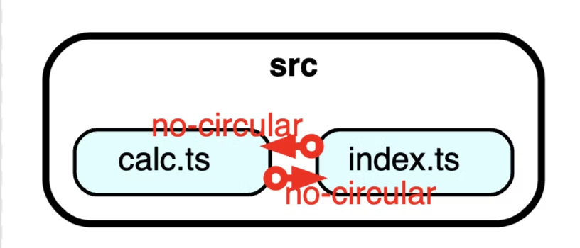

# dependency-cruiserを紹介します 🚢

@taiyama1212（株式会社iimon）
<style>
section::after {
  content: attr(data-marpit-pagination) " / " attr(data-marpit-pagination-total);
}
</style>
---

# 自己紹介🦍

* たいせい（株式会社iimon）
* Qiitaで毎月10個記事アウトプット中💫😇💫
* SNS
    * X(taiyama1212)
    * Qiita(yamatai12)
* 好きなこと
    * 抹茶ラテ🍵、旅行✈️

---

# 概要 🖼️
外部イベントでdependency-cruiserを紹介して頂きました。

「循環依存を検知」

「private packageな設計を守る」

このようなことを実現してくれるライブラリです！

---

# 目次 🗒️
* dependency-cruiserとは 🤔
* 導入方法 🚧
* 検証の例 🚨
* 使い所 💡
* package private のような設計を作る 📦
* 最後に🚢

---

# dependency-cruiserとは 🤔
JavaScript、TypeScriptの依存関係を調べ次の2つのことをします。
* カスタムのルールと照らし合わせて検証
* テキスト、グラフィックででルール違反を報告

---

# 導入方法 🚧
```terminal
# npm install --save-dev dependency-cruiser
# npx depcruise --init
✔ Where do your source files live? … src
✔ Do your test files live in a separate folder? … no
✔ Looks like you're using a 'tsconfig.json'. Use that? … yes
✔ Full path to your 'tsconfig.json › tsconfig.json
✔ Also regard TypeScript dependencies that exist only before compilation? … yes
✔ Looks like you're using webpack - specify a webpack config? … yes

  ✔ Successfully created '.dependency-cruiser.js'
```
質問に答えるだけで設定ファイルを作成してくれます✨

---

# 検証の例 🚨
循環依存の検知

index.ts
```ts
import { sub } from "./calc";
export const violation = "violation";
```
calc.ts
```ts
import { violation } from "./index";

export const calc = "calc"
```

これを検証すると。。

---

# 

```
# npx depcruise src

  error no-circular: src/calc.ts → 
      src/index.ts →
      src/calc.ts

✘ 1 dependency violations (1 errors, 0 warnings). 2 modules, 2 dependencies cruised.
```



エラーになりました！🚨

---

# 使い所 💡

* 循環依存関係をgithub-actions上で検知
* package private のような設計を作る

---

# package private のような設計を作る📦
```ts
module.exports = {
  forbidden: [
    {
      name: `1. '_'から始まるディレクトリ内部のファイルは、同ディレクトリ内のファイルまたは、一つ上の階層のディレクトリのファイルからのみimport可能`,
      severity: 'error',
      from: { path: ['(.*)\\/.*\\.ts'], pathNot: ['.*\\.spec\\.ts$'] },
      to: {
        path: ['_\\w+\\/\\w+\\.ts$'],
        pathNot: ['$1\\/_\\w+\\/\\w+\\.ts$', '$1\\/\\w+\\.ts$'],
      },
    },
    {
      name: `2. '_'から始まるファイルは同階層に置かれたファイルからのみimport可能`,
      severity: 'error',
      from: { path: ['(.*)\\/.*\\.ts$'], pathNot: ['.*\\.spec\\.ts$'] },
      to: {
        path: ['.*\\/_\\w+.ts$'],
        pathNot: ['$1\\/_\\w+.ts$'],
      },
    },
]
```
fromがimport(require)する側で、toがexportする側です。
pathがルールを適用するファイルパスで、pathNotが適用されないファイルパスです。

---

# 最後に 🚢
循環依存の検知をしてくれるのは魅力的です。

また、private pacakgeな設計や、自分が作りたい設計、モジュール管理が心置き無くできるようになります✨

デメリットは「コマンドを実行しないと検知されない」ということです。

eslint-plugin-import-access,
eslint-plugin-strict-dependenciesとの使い分けを考えていきたいです💪
## ありがとうございました！！
