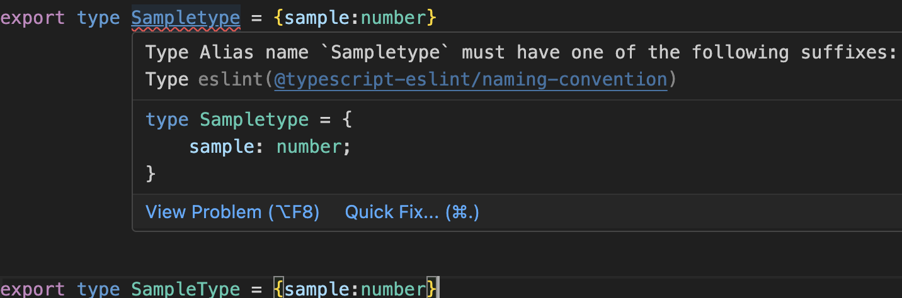
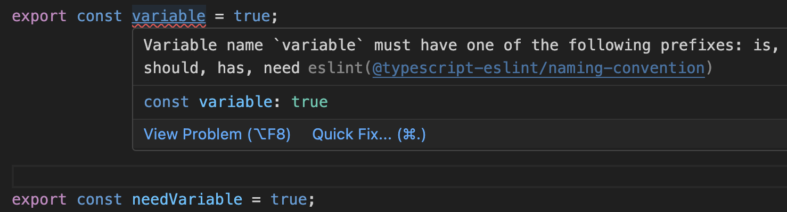
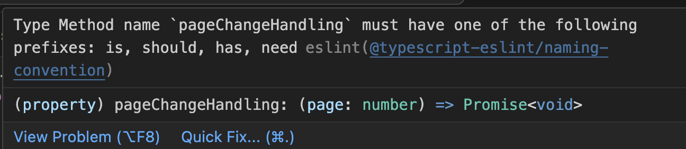

# ESLintで命名規則のチェックをする

@taiyama1212
<style>
section::after {
  content: attr(data-marpit-pagination) " / " attr(data-marpit-pagination-total);
}
</style>
---

# 自己紹介

* 山根大生（株式会社iimon）
* Qiitaで毎月10個記事を書き、休日を光の速さで過ごしています💫
* SNS
    * X(taiyama1212)
    * Qiita(yamatai12)
* 好きなこと
    * 抹茶ラテ🍵、旅行✈️
---

# 背景

命名規則をドキュメントで管理している
↓
ESLintに任せられないだろうか？🤔

---

# 目次
* typescript-eslintのnaming-conventionとは
* ルールの例
* 型エイリアス
* 変数,関数,引数で返り値、値がbooleanの時
* 課題1 メソッドで返り値がbooleanの時は適切なチェックがされなかった
* 課題2 関数型コンポーネント名をPascalCaseに指定できなかった
* まとめ

---
# typescript-eslintのnaming-conventionとは
命名規則を強制することができます。

---

# ルールの例
```js
'@typescript-eslint/naming-convention': [
      'error',
       // ①型エイリアスは接尾辞にTypeをつける
      {
        selector: 'typeAlias',
        format: ['PascalCase'],
        suffix: ['Type'],
      },
      // TODO メソッドでもbooleanを返す場合のルールを追加する
      // ②変数,関数,引数で返り値がboolean
      {
        selector: ['variable', 'function', 'parameter'],
        types: ['boolean'],
        format: ['PascalCase'],// prefixを除いたcaseです　例）isDev → prefixでisが取られ、Devが残る
        prefix: ['is', 'should', 'has', 'need'],
        //disabledとrequiredは例外的にprefixを必要としない
        filter: {
          regex: 'disabled|required',
          match: false,
        },
      },
      // ③変数、関数、引数、メソッド,引数
      {
        selector: ['variable', 'function', 'parameter', 'method'],
        format: ['camelCase'],
      },
      // ④プロパティ
      {
        selector: ['property'],
        format: ['camelCase', 'snake_case'],
      },
      // ⑤定数
      {
        selector: 'variable',
        format: ['camelCase', 'UPPER_CASE'],
        modifiers: ['const'],
      },
      // ついでに追加しました
      {
        selector: 'class',
        format: ['PascalCase'],
      },
]

```

---

# 型エイリアス
```js
      {
        selector: 'typeAlias',
        format: ['PascalCase'],
        suffix: ['Type'],
      },
```



---

# 変数,関数,引数で返り値がbooleanの時

```ts
      {
        selector: ['variable', 'function', 'parameter'],
        types: ['boolean'],
        format: ['PascalCase'],// prefixを除いたcaseです　例）isDev → prefixでisが取られ、Devが残る
        prefix: ['is', 'should', 'has', 'need'],
        //disabledとrequiredは例外的にprefixを必要としない
        filter: {
          regex: 'disabled|required',
          match: false,
        },
      },
```


---

# 課題1 メソッドで返り値がbooleanの時は適切なチェックがされなかった

```ts
export type CustomPaginationPropsType = {
    total: number;
    pageSize: number;
    pageChangeHandling: (page: number) => Promise<void>;
  };
```


---

# 課題2 関数型コンポーネント名をPascalCaseに指定できなかった
```ts
'@typescript-eslint/naming-convention': [
      'error',
      {
        selector: ['variable'],
        format: ['camelCase'],
      },
~~~
]
```
eslint-plugin-reactのjsx-pascal-caseも適用すると以下の矛盾が起こる

naming-convention→ コンポーネント名はcamelCase
eslint-plugin-react/jsx-pascal-case→ コンポーネント名はPascalCase

---

# まとめ
やや不完全ですが、社内で決めている命名規則をほとんどESLintで実現できるのではないでしょうか？
これを導入すればRvで命名規則に指摘されることもなくなりますし、命名規則を覚えなくても済むので便利だなと思いました

## ありがとうございました！！