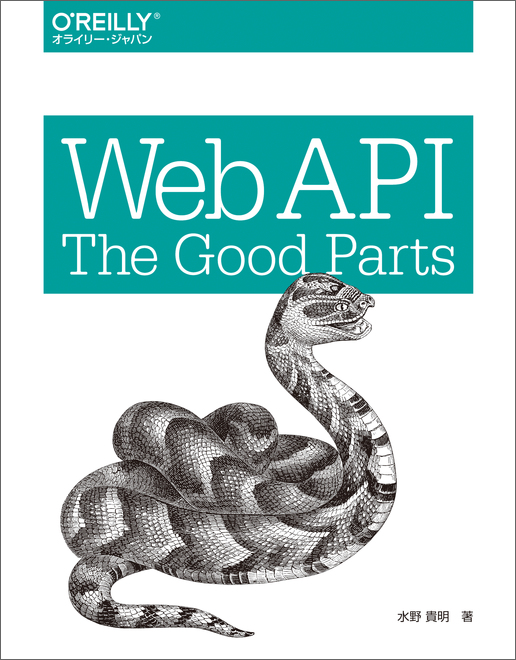
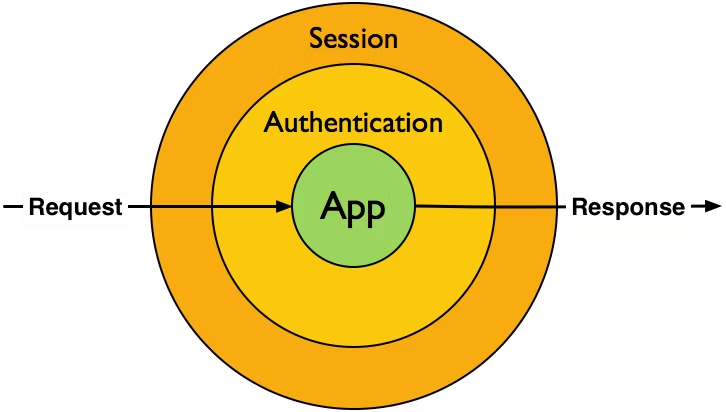
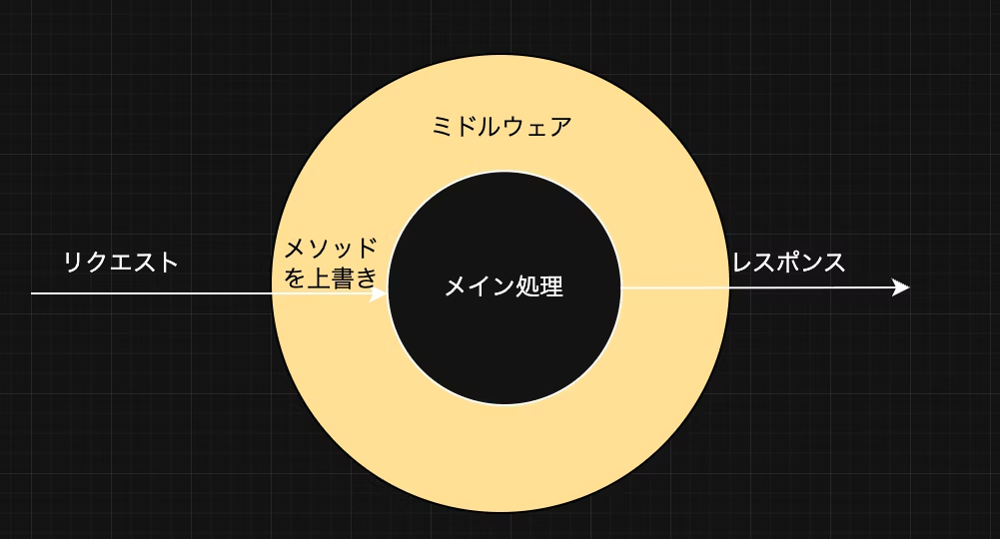

# Goで遊ぶHTTPミドルウェア ― X-HTTP-Method-Overrideを試してみた

Taisei Yamane(taiyama1212)

---

# 自己紹介

* 山根大生（株式会社immedio）
* SNS
    * X(taiyama1212)
    * Qiita(yamatai12)
    * Zenn(yamatai12)
* 好きなこと
    * ジムで体を鍛える🏋️、旅行✈️
---

# 目次
* <span class="red">背景</span>
* X-HTTP-Method-Overrideヘッダとは
* X-HTTP-Method-OverrideヘッダーからMethodを上書きする機能を持つフレームワークやミドルウェア
* そもそも
* 実装：Goでミドルウェアを実装しX-HTTP-Method-Overrideからメソッドを上書きする
* 今後調べたいこと
* 最後に
---

# 背景🖼️

X-HTTP-Method-Overrideヘッダを以下の本を読んで知った


https://www.oreilly.co.jp/books/9784873116860/

>サーバー側のフレームワークやミドルウェアがこのヘッダをサポートして自動で解釈してくれる場合も多い

どんなフレームワークやミドルウェアがこれに対応しているのか？
Goのビルトインではどんな記述をする必要があるのか？

---

# 目次
* 背景
* <span class="red">X-HTTP-Method-Overrideヘッダとは</span>
* X-HTTP-Method-OverrideヘッダーからMethodを上書きする機能を持つフレームワークやミドルウェア
* そもそもミドルウェアとは
* 実装：Goでミドルウェアを実装しX-HTTP-Method-Overrideからメソッドを上書きする
* 今後調べたいこと
* 最後に

---

# X-HTTP-Method-Overrideヘッダとは 💡

`API側でGET,POST以外のメソッドをPOSTを使って表現することを許可するのを可能にするヘッダ`のこと

例えばHTMLのForm経由だとメソッドにはGET,POST`しか指定できず、PATCH,DELETE,PUTはサポートされていない

---

# 目次
* 背景
* X-HTTP-Method-Overrideヘッダとは
* <span class="red">X-HTTP-Method-OverrideヘッダーからMethodを上書きする機能を持つフレームワークやミドルウェア</span>
* そもそもミドルウェアとは
* 実装：Goでミドルウェアを実装しX-HTTP-Method-Overrideからメソッドを上書きする
* 今後調べたいこと
* 最後に

---

# X-HTTP-Method-OverrideヘッダーからMethodを上書きする機能を持つフレームワークやミドルウェア 🔍

- JavaScript
    Expressでは`method-override`というミドルウェアを使うことで実現できる
    https://expressjs.com/en/resources/middleware/method-override.html
- PHP
    slimでは`MethodOverrideMiddleware`というミドルウェアを使うことで実現できる
    https://www.slimframework.com/docs/v4/middleware/method-overriding.html

---

- Go
    メジャー所のものだと見当たらなかった
- Ruby
  `Rack`でミドルウェアが用意されている
  https://github.com/rack/rack/blob/main/lib/rack/method_override.rb

---

# 目次
* 背景
* X-HTTP-Method-Overrideヘッダとは
* X-HTTP-Method-OverrideヘッダーからMethodを上書きする機能を持つフレームワークやミドルウェア
* <span class="red">そもそもミドルウェアとは</span>
* 実装：Goでミドルウェアを実装しX-HTTP-Method-Overrideからメソッドを上書きする
* 今後調べたいこと
* 最後に

---

# そもそもミドルウェアとは 🔄


https://mattstauffer.com/blog/laravel-5.0-middleware-filter-style/#what-is-middleware

`リクエストを受け取り、何らかの処理を行い、次の層に別のリクエストオブジェクトを返す`

---

# 目次
* 背景
* X-HTTP-Method-Overrideヘッダとは
* X-HTTP-Method-OverrideヘッダーからMethodを上書きする機能を持つフレームワークやミドルウェア
* そもそもミドルウェアとは
* <span class="red">実装：Goでミドルウェアを実装しX-HTTP-Method-Overrideからメソッドを上書きする</span>
* 今後調べたいこと
* 最後に

---

# 実装：Goでミドルウェアを実装しX-HTTP-Method-Overrideからメソッドを上書きする 🏃‍♀️



---

```go
func (s *Server) methodOverrideMiddleware(next http.Handler) http.Handler {
	return http.HandlerFunc(func(w http.ResponseWriter, r *http.Request) {
		if r.Method == http.MethodPost {
			if override := r.Header.Get("X-HTTP-Method-Override"); override != "" {
				r.Method = override
			}
		}
		next.ServeHTTP(w, r)
	})
}
```

methodOverrideMiddlewareは、引数として受け取ったnext http.Handlerをラップし、新しいhttp.Handlerを返している。

ミドルウェアは`デコレーターパターン`で実装していることが分かった。

---

# 目次
* 背景
* X-HTTP-Method-Overrideヘッダとは
* X-HTTP-Method-OverrideヘッダーからMethodを上書きする機能を持つフレームワークやミドルウェア
* そもそもミドルウェアとは
* 実装：Goでミドルウェアを実装しX-HTTP-Method-Overrideからメソッドを上書きする
* <span class="red">今後調べたいこと</span>
* 最後に

---


# 今後調べたいこと

- HTTPメソッドをPost,Getメソッドでしかクライアント側で指定できないことがあるケースについて
- HTMLのForm経由だとメソッドにはGET,POST`しか指定できない理由について

---

# 目次
* 背景
* X-HTTP-Method-Overrideヘッダとは
* X-HTTP-Method-OverrideヘッダーからMethodを上書きする機能を持つフレームワークやミドルウェア
* そもそもミドルウェアとは
* 実装：Goでミドルウェアを実装しX-HTTP-Method-Overrideからメソッドを上書きする
* 今後調べたいこと
* <span class="red">最後に</span>

---


# 最後に 
以下を理解できました

- X-HTTP-Method-Overrideヘッダとは`API側でGET,POST以外のメソッドをPOSTを使って表現することを許可するのを可能にするヘッダ`のこと
- ミドルウェアは`リクエストを受け取り、何らかの処理を行い、次の層に別のリクエストオブジェクトを返す`役割を持つ
例えばミドルウェアでX-HTTP-Method-Overrideヘッダーからメソッドを上書きすることができる

## ありがとうございました！！ 

---

# 参考✨

- https://www.oreilly.co.jp/books/9784873116860/

- https://mattstauffer.com/blog/laravel-5.0-middleware-filter-style/#what-is-middleware

- https://blog.jxck.io/entries/2023-11-27/hixie.html

- https://qiita.com/shoking/items/4e26b5438c3437400f53

- https://www.alexedwards.net/blog/http-method-spoofing

- https://www.slimframework.com/docs/v4/middleware/method-overriding.html

- https://blog.yezz.me/blog/Decorator-and-API-design

- https://www.geeksforgeeks.org/system-design/decorator-pattern/


---
- https://qiita.com/mk777/items/6f463466027939a4b137
- https://qiita.com/giraffate/items/ea962f1cdad21c2f68aa
- https://dev.to/atanda0x/middleware-in-go-nfi
- https://qiita.com/sinke_123/items/ae6bd6cb7a95dd7d5ce8
- https://worldvectorlogo.com/ja/logo/gopher