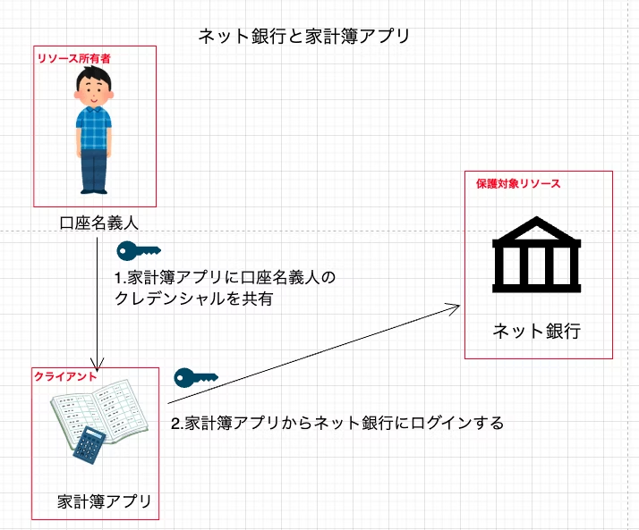
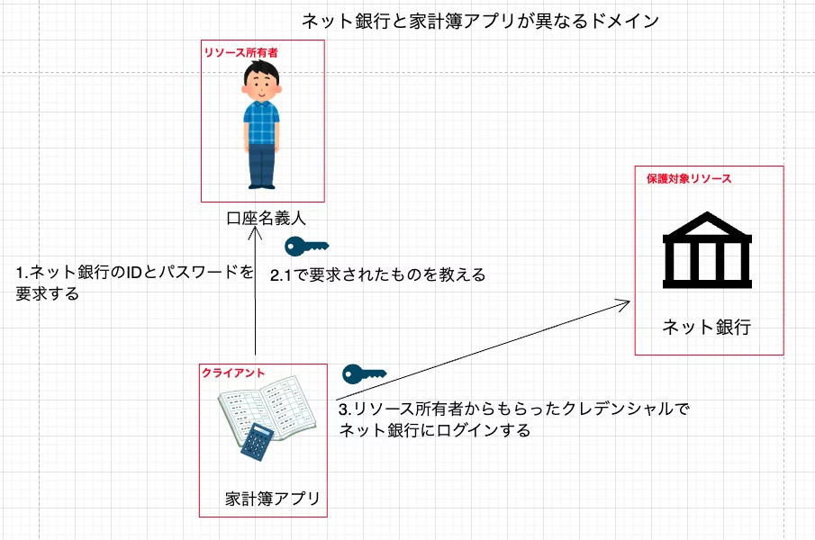
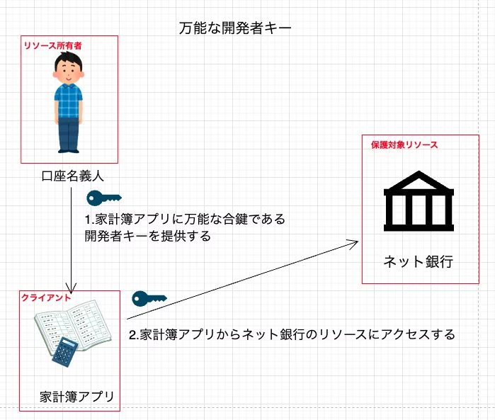
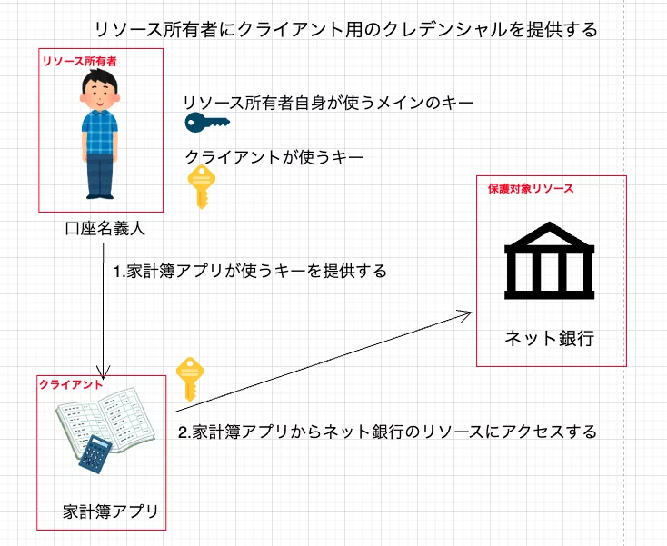
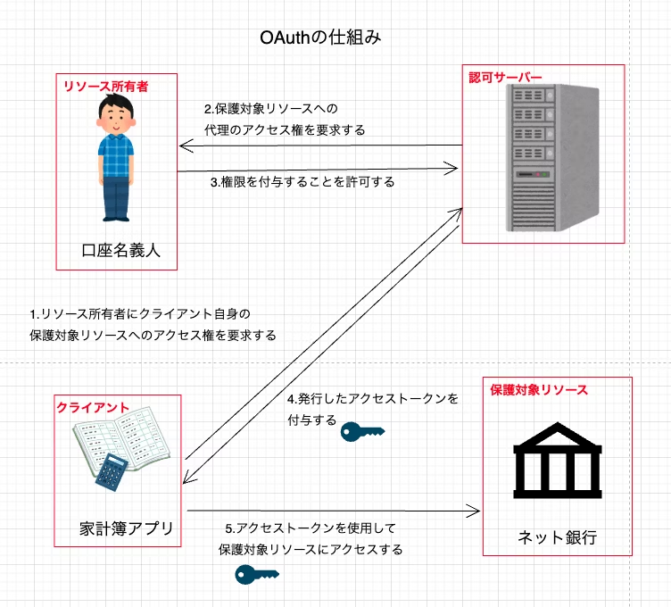

# OAuth登場前にあった複数サービス連携の課題🔑

yamatai12

---

# 自己紹介

* yamatai12（Webエンジニア）
* SNS
    * X(taiyama1212)
    * Qiita(yamatai12)
    * Zenn(yamatai12)
* 好きなこと
    * ジム🏋️
---

# 目次
* 目的
* OAuthとは 💡
* OAuth登場前の複数サービス連携の課題〜クレデンシャルの共有〜 🤝
* OAuth登場前の複数サービス連携の課題〜万能な開発者キー〜 💪
* OAuth登場前の複数サービス連携の課題〜リソース所有者にクライアント用のクレデンシャルを提供する〜 🔑
* 課題を解決するOAuthの仕組み ✨
* まとめ
---

# 目的
OAuth登場前に複数サービスを連携させようとしたときに直面した課題を整理する。
それがOAuthによってどう解決されるのかをまとめる。

---
# 目次
* 目的
* OAuthとは 💡
* OAuth登場前の複数サービス連携の課題〜クレデンシャルの共有〜 🤝
* OAuth登場前の複数サービス連携の課題〜万能な開発者キー〜 💪
* OAuth登場前の複数サービス連携の課題〜リソース所有者にクライアント用のクレデンシャルを提供する〜 🔑
* 課題を解決するOAuthの仕組み ✨
* まとめ
---

# OAuthとは 💡

用語整理
- リソース所有者：ユーザー本人
- クライアント：ユーザーのデータ（リソース）を使いたいアプリ
- 保護対象リソース：ユーザーのデータを持っているサービス

リソース所有者が、外部のアプリにリソース所有者の代わりになってリソースにアクセスする際に何ができるかを許可する仕組みのこと。

比喩するなら車のバレットキー。

---
# 目次
* 目的
* OAuthとは 💡
* OAuth登場前の複数サービス連携の課題〜クレデンシャルの共有〜 🤝
* OAuth登場前の複数サービス連携の課題〜万能な開発者キー〜 💪
* OAuth登場前の複数サービス連携の課題〜リソース所有者にクライアント用のクレデンシャルを提供する〜 🔑
* 課題を解決するOAuthの仕組み ✨
* まとめ

---
# 目次
* 目的
* OAuthとは 💡
* OAuth登場前の複数サービス連携の課題〜クレデンシャルの共有〜 🤝
* OAuth登場前の複数サービス連携の課題〜万能な開発者キー〜 💪
* OAuth登場前の複数サービス連携の課題〜リソース所有者にクライアント用のクレデンシャルを提供する〜 🔑
* 課題を解決するOAuthの仕組み ✨
* まとめ
---

## OAuth登場前の複数サービス連携の課題
〜クレデンシャルの共有〜 🤝
ネット銀行と家計簿アプリが同一ドメインである場合

保護対象リソースから見ると、ログインしたのが本人か、アプリ経由かを区別できない

---

ネット銀行と家計簿アプリが別ドメインの場合

クレデンシャルが漏れると、第三者も自由にログインできる

---

# 目次
* 目的
* OAuthとは 💡
* OAuth登場前の複数サービス連携の課題〜クレデンシャルの共有〜 🤝
* OAuth登場前の複数サービス連携の課題〜万能な開発者キー〜 💪
* OAuth登場前の複数サービス連携の課題〜リソース所有者にクライアント用のクレデンシャルを提供する〜 🔑
* 課題を解決するOAuthの仕組み ✨
* まとめ

---

## OAuth登場前の複数サービス連携の課題
〜万能な開発者キー〜

開発者キーは強力な権限を持つ → 漏洩すれば多くのユーザーに被害が及ぶ

---

# 目次
* 目的
* OAuthとは 💡
* OAuth登場前の複数サービス連携の課題〜クレデンシャルの共有〜 🤝
* OAuth登場前の複数サービス連携の課題〜万能な開発者キー〜 💪
* OAuth登場前の複数サービス連携の課題〜リソース所有者にクライアント用のクレデンシャルを提供する〜 🔑
* 課題を解決するOAuthの仕組み ✨
* まとめ

---

## OAuth登場前の複数サービス連携の課題
リソース所有者にクライアント用のクレデンシャルを提供する🔑

ユーザーは「自分のキー」に加えてクライアント用キーも管理が必要。失効し忘れると、アプリからのアクセスが残る。

---

# 目次
* 目的
* OAuthとは 💡
* OAuth登場前の複数サービス連携の課題〜クレデンシャルの共有〜 🤝
* OAuth登場前の複数サービス連携の課題〜万能な開発者キー〜 💪
* OAuth登場前の複数サービス連携の課題〜リソース所有者にクライアント用のクレデンシャルを提供する〜 🔑
* 課題を解決するOAuthの仕組み ✨
* まとめ

---

## 課題を解決するOAuthの仕組み ✨

<b>認可サーバーとは</b>
- 保護対象リソースに信頼されているサーバー
- 保護対象リソースへ制限したアクセスをする為のクレデンシャル（アクセストークン）をクライアントに発行する

---

---

この仕組みにより前の章まで挙げたOAuth登場前の課題を解決できる。

- リソース所有者のクレデンシャルがクライアントに共有されない
- クライアントに与えられたトークンは権限が限られているのでリソース所有者が代理で依頼したい操作のみしかできない
- 一般的にリソース所有者はこのアクセストークンを管理する必要はない

---

## まとめ

- OAuthが登場する前、複数サービスを連携させる方法には以下の課題があった
  - クレデンシャルの共有：ユーザーのID/パスワードを直接渡すリスク
  - 万能な開発者キー：権限が強すぎて漏洩した場合に被害範囲が大きい
  - クライアント用クレデンシャルの発行：ユーザーに過剰な管理負担

- OAuthではこれらの課題を解決する仕組みを提供する
  - ユーザーのクレデンシャルを外部アプリに共有しない
  - アクセス権を制限できる
  - 認可サーバーがアクセストークンを発行するため、ユーザーの管理負担が軽い

---

# 参考
- https://www.oreilly.co.jp/books/9784873116860/
- https://www.shoeisha.co.jp/book/detail/9784798159294
- https://tech.iimon.co.jp/entry/2025/05/13/180000
- https://qiita.com/yamatai12/items/e6b8efbba1f2f95d225a