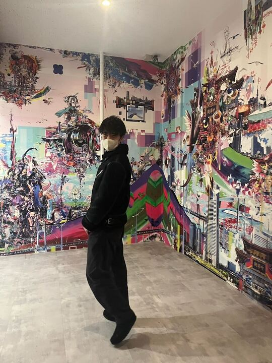

# 記事の一歩目は業務内容から

Taisei Yamane(taiyama1212)

---

# 自己紹介

* 山根大生
* 株式会社iimon
* フロントエンドエンジニア
* SNS
    * X(taiyama1212)
    * Wantedly(yamatai_1212)
    * Qiita(yamatai12)
* 好きなこと
    * 旅行✈️
---

# 記事を書かれている方はいらっしゃいますか？

🙌🙌🙌🙌🙌🙌🙌🙌🙌🙌🙌🙌🙌🙌🙌🙌🙌🙌🙌

---

# アジェンダ
* 記事を書いたきっかけ
* 業務派生で考える記事のネタ
* アウトプットと業務の繋がり
* まとめ

---

# 記事を書いたきっかけ
作りたい、携わりたいサービス、OSSがパッと出てこなかった
↓
とりあえず業務で学んだことの復習
↓
記事を書いてみる

---

# 業務派生で考える記事のネタ
* 詰まった
* メンバーが困っている
* 深掘りしたい

--- 

# 記事のアウトプットと業務の繋がり
## 記事の種類ごとによる繋がり
* 詰まった→自分用のトラブルシューティング
* メンバーが困っている→調べたことを導入するチャンス
* 深掘りしたい→今後の業務で役に立つかもしれない

## その他気づいたこと
* 社内で記事を共有する
自分の強い領域をメンバーが把握できる→相談してもらいやすくなる
自分が勉強していることをメンバーに知ってもらえる→フィードバックがもらえる
---

# まとめ
* 記事を書いたことのない方の背中を押せたなら嬉しいです
* 内容はなんでも大丈夫です（不安な時は「備忘録」って付ければOKです）
    例:GitHub Actionsをローカルでテストする方法

## ありがとうございました！！