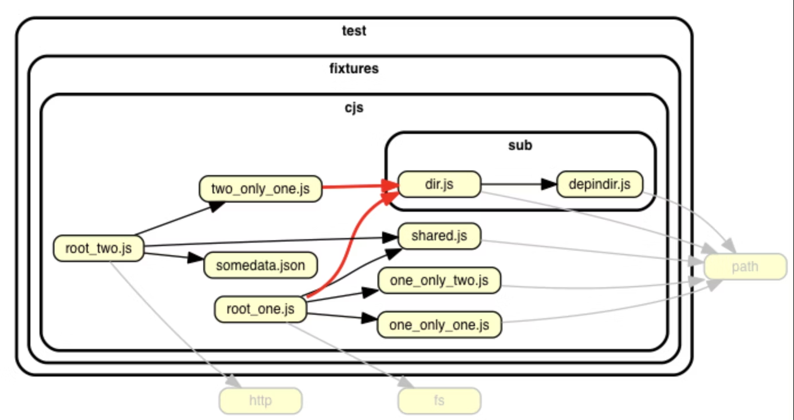
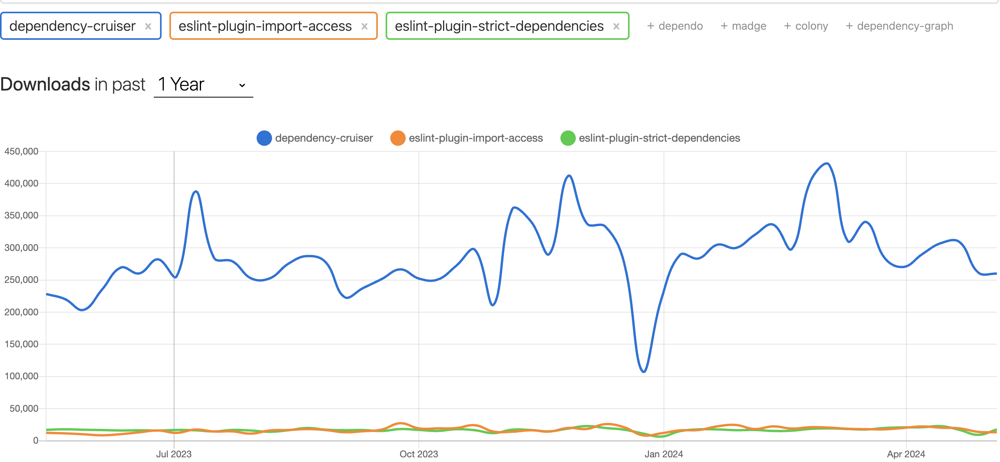

# TypeScriptでpackage privateを実現する3つの方法を比較した

Taisei Yamane(@taiyama1212)
<style>
section::after {
  content: attr(data-marpit-pagination) " / " attr(data-marpit-pagination-total);
}
</style>
---

# 自己紹介

* 山根大生（株式会社iimon）
* Qiitaで毎月10個記事を書き、休日を光の速さで過ごしています💫
* SNS
    * X(taiyama1212)
    * Qiita(yamatai12)
* 好きなこと
    * 抹茶ラテ🍵、旅行✈️
---

# 背景

宣言をexportするとどこからでもimportされてしまう、けどモジュール内に複数の宣言を記述すると肥大化する。。
↓
TypeScriptもpackage privateで管理したい！

そこで業務で導入する想定で3つのライブラリを比較しました

---

# 目次
* dependency-cruiserとは
* dependency-cruiserでpackage-privateを実現する
* eslint-plugin-import-accessとは
* eslint-plugin-import-accessでpackage-privateを実現する
* eslint-plugin-strict-dependenciesとは
* eslint-plugin-strict-dependenciesでpackage-privateを実現する
* 業務で導入する場合はどのライブラリが妥当か

---
# dependency-cruiserとは
モジュールの依存関係を調べます。
その後に次のようなことをします。

* 作成したルールと照らし合わせて検証する
* テキスト、グラフィックでルール違反を報告する



---

# dependency-cruiserでpackage-privateを実現する

* _から始まるディレクトリ内部のファイルは、同ディレクトリ内のファイルまたは、直上のディレクトリのファイルからのみimport可能
* _から始まるファイルは同階層に置かれたファイルからのみimport可能

.dependency-cruiser.js
```js
module.exports = {
  forbidden: [
    {
      name: `1. '_'から始まるディレクトリ内部のファイルは、同ディレクトリ内のファイルまたは、一つ上の階層のディレクトリのファイルからのみimport可能`,
      severity: 'error',
      from: { path: ['(.*)\\/.*\\.ts'], pathNot: ['.*\\.spec\\.ts$'] },
      to: {
        path: ['_\\w+\\/\\w+\\.ts$'],
        pathNot: ['$1\\/_\\w+\\/\\w+\\.ts$', '$1\\/\\w+\\.ts$'],
      },
    },
    {
      name: `2. '_'から始まるファイルは同階層に置かれたファイルからのみimport可能`,
      severity: 'error',
      from: { path: ['(.*)\\/.*\\.ts$'], pathNot: ['.*\\.spec\\.ts$'] },
      to: {
        path: ['.*\\/_\\w+.ts$'],
        pathNot: ['$1\\/_\\w+.ts$'],
      },
    },
]
```
---

# eslint-plugin-import-accessとは
ディレクトリ外のファイルからインポートすることを制限する ESLint プラグインです。

---

# eslint-plugin-import-accessでpackage-privateを実現する
ディレクトリの外で呼び出したくない宣言に`@package`をつけます
```ts
/**
 * @package
 */
export const fooPackageVariable = "I am package-private export";

```
--- 

# eslint-plugin-strict-dependenciesとは
モジュールの依存性ルールを定義するための ESLint プラグインです。

---

# eslint-plugin-strict-dependenciesでpackage-privateを実現する

* `module`: importが制限されるモジュールのパス
* `allowReferenceFrom`: `module`で指定されたパスに該当するモジュールのインポートを許可するファイルのパス

.eslintrc
```.eslintrc
'strict-dependencies/strict-dependencies': [
      'error',
      [
        {
          module: 'src/domains/sample',
          allowReferenceFrom: ['src/domains/sample'],
        },
      ],
    ],

```
---

# 業務で導入する場合はどのライブラリが妥当か
コミュニティの規模からdependency-cruiserが妥当と考えました。
勿論以下のデメリットはあります。
* 設定ファイルに慣れる必要があります
* コマンド実行するまでは意図しない依存関係を検知できないです

eslint-plugin-import-access、eslint-plugin-strict-dependenciesはエディタで即座に検知できるのがやはり魅力です！今後の普及を期待します✨


---

# ありがとうございました！！
