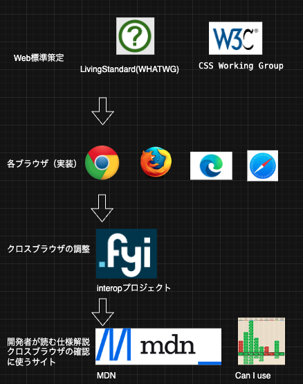

# Web標準と互換性の世界をざっくり見渡してみよう

Taisei Yamane(taiyama1212)

---

# 自己紹介

* 山根大生（Webエンジニア）
* SNS
    * X(taiyama1212)
    * Qiita(yamatai12)
    * Zenn(yamatai12)
* 好きなこと
    * ジムで体を鍛える🏋️、旅行✈️
---

# 目次
* 背景
* Web標準とは
* HTMLとCSSに関するWeb標準
* interopプロジェクト
* ブラウザの互換性を確認するのに役立つサイト
* まとめ　Web標準が開発者に届くまでの流れ
---

# 背景🖼️

Web標準って色んな組織が関わっていて分かりづらい
フロントエンドに関するものだと以下が関係しているのか？
openui,w3c,whatwg,htmllinvingstandard,interop,caniuse等の組織、プロジェクト、サイト

---
# 目次
* 背景
* Web標準とは
* HTMLとCSSに関するWeb標準
* interopプロジェクト
* ブラウザの互換性を確認するのに役立つサイト
* まとめ　Web標準が開発者に届くまでの流れ
* 最後に
---

# Web標準とは

>国際標準化団体によって策定される、 Webの仕組みを定義する規則

https://developer.mozilla.org/ja/docs/Glossary/Web_standards

<b>役割</b>

- Webを最大限に利用可能でアクセス可能に保つために調整する
- 現在の状況を改善し、新しい状況に適応するために進化する

---
# 目次
* 背景
* Web標準とは
* HTMLとCSSに関するWeb標準
* interopプロジェクト
* ブラウザの互換性を確認するのに役立つサイト
* まとめ　Web標準が開発者に届くまでの流れ
* 最後に
---

# HTMLとCSSに関するWeb標準

<b>W3C</b>
マークアップ言語 (HTMLなど) 、スタイル定義 (CSS)、 DOM、アクセシビリティの仕様を策定

<b>WHATWG</b>
DOM,HTMLなどを扱う(Living Standard)
https://html.spec.whatwg.org/multipage/

<b>CSS Working Group</b>
CSSに関する仕様を専門で策定
W3Cの下部組織
https://www.w3.org/groups/wg/css/

---

## 2019年にHTML/DOMの仕様は**WHATWGの Living Standard が唯一の標準**に
>2019年5月、W3CとWHATWGは、HTMLおよびDOM仕様の単一バージョンの開発に関する協力協定に署名した。

https://www.w3.org/blog/2021/whatwg-review-drafts-of-html-and-dom-endorsed-as-w3c-recommendations/

---
# 目次
* 背景
* Web標準とは
* HTMLとCSSに関するWeb標準
* interopプロジェクト
* ブラウザの互換性を確認するのに役立つサイト
* まとめ　Web標準が開発者に届くまでの流れ
---

## interopプロジェクト

Webの相互運用性を向上させるためのクロスブラウザの取り組み

https://wpt.fyi/interop-2025

---
# 目次
* 背景
* Web標準とは
* HTMLとCSSに関するWeb標準
* interopプロジェクト
* ブラウザの互換性を確認するのに役立つサイト
* まとめ　Web標準が開発者に届くまでの流れ

---

## ブラウザの互換性を確認するのに役立つサイト

<b>MDN</b>
Web開発者向けドキュメント
ブラウザ互換性を見ることもできる

<b>Can I use</b>
ブラウザ互換性を<b>一瞬で見る</b>のに便利なサイト
Can I Use はMDNの一部データを使っている
https://caniuse.com/

---
# 目次
* 背景
* Web標準とは
* HTMLとCSSに関するWeb標準
* interopプロジェクト
* ブラウザの互換性を確認するのに役立つサイト
* まとめ　Web標準が開発者に届くまでの流れ

---

## まとめ　Web標準が開発者に届くまでの流れ

---

# ご清聴ありがとうございました！！

---

# 参考
- https://developer.mozilla.org/ja/docs/Learn_web_development/Getting_started/Web_standards/The_web_standards_model?utm_source=chatgpt.com
- https://www.reddit.com/r/html5/comments/5lkfnk/beginner_here_wanting_to_learn_html/?utm_source=chatgpt.com
- https://qiita.com/yamatai12/items/47a682d4a2a93462a033
- https://wpt.fyi/interop-2025
- https://caniuse.com/

